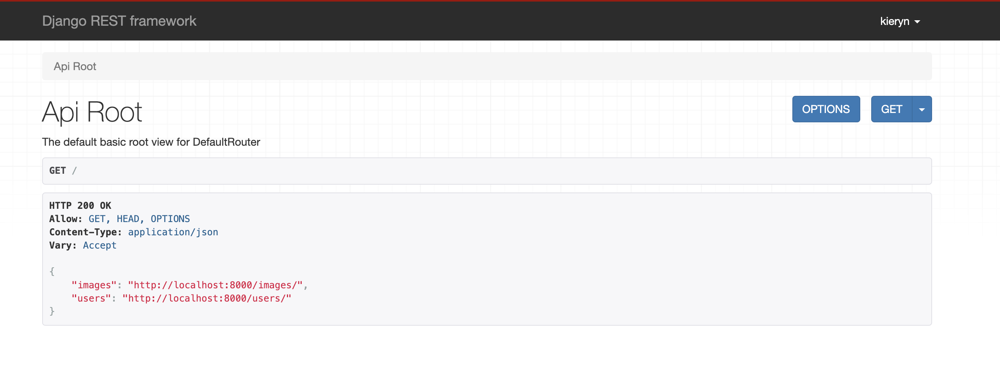
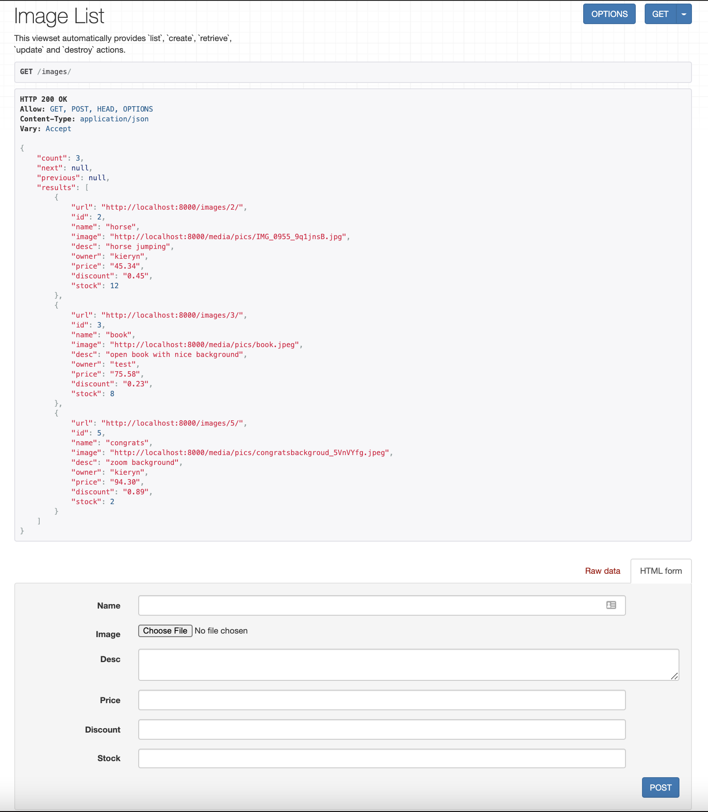
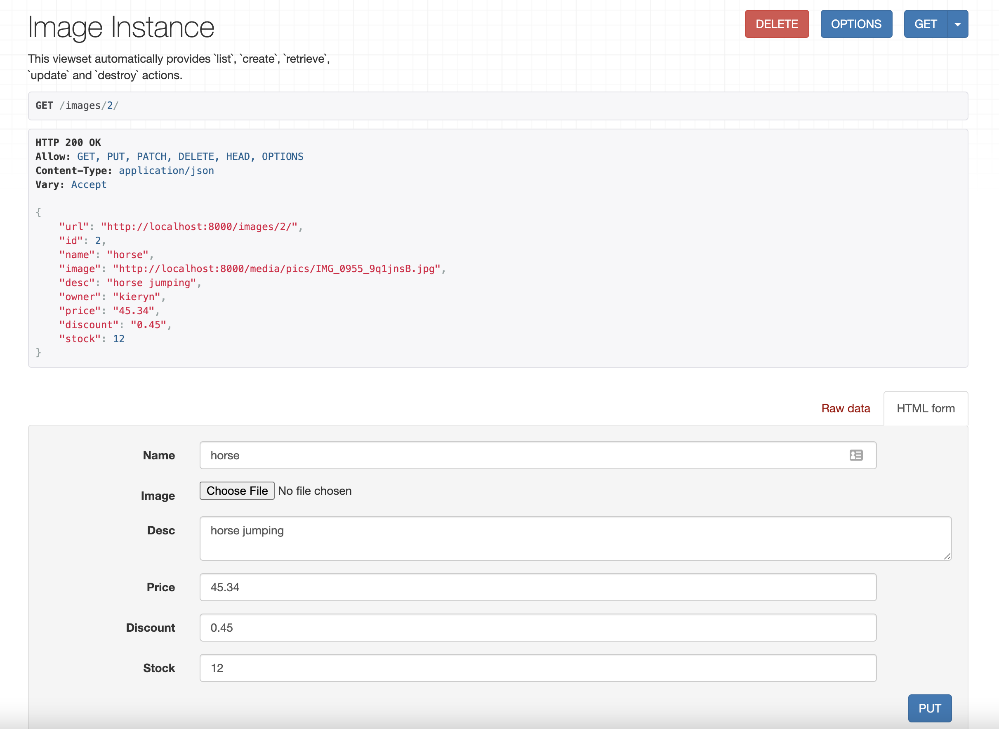
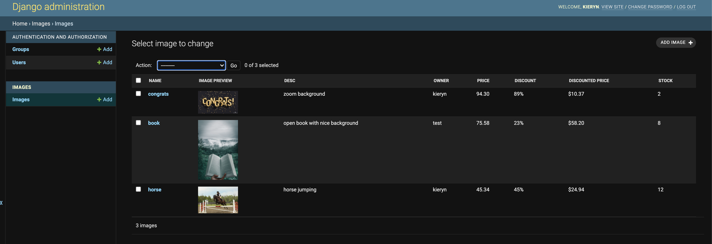

# image-repo
Image repository for the Fall 2021 Shopify Backend Developer Challenge. Built using Django and Django Rest Framework. The application consists of two main parts: the API and the admin page. 

## Image Fields
Image objects consist of the following 7 fields: name, image, desc, owner, price, discount, and stock.  

## API 



In the API users must login and then can see all the images and users by navigating to localhost:8000/images/ and localhost:8000/users/, respectively. 



From localhost:8000/images/ users can make a post request to add another image to the repository. The owner for the image will be set to the user that is currently logged in.



Users can navigate to localhost:8000/images/{image-id} to view a specific image. If the user logged in is the owner of the image they will also be able to update or delete the image.

## Admin page



The admin page has similar functionality to the API but only staff users can interact through it. One additional feature that the admin page has is the ability to delete selected/bulk/all images through the action dropdown at the top of the page. 

## Installation and Setup
First clone the repository
```
git clone https://github.com/kieryndavison/image-repo.git
cd image-repo
```

Next, install dependencies and migrate the db
```
pip install requirements.txt
python manage.py migrate
python manage.py runserver
```
Now you can visit localhost:8000 for the API or localhost:8000/admin/images/image for the admin page.

## Testing
There are unit tests for the models, views and permissions files. To run all test use
```
python manage.py test
```
If you would like to only run a specific test(s) you can specify an additional parameter that provides the full python dotted path the package, module, TestCase subclass, or test you would like to run. For example, to run only the tests from the ImageViewSetTest class in the images/test_views.py file you would write:
```
python manage.py test images.test_views.ImageViewSetTest
```
